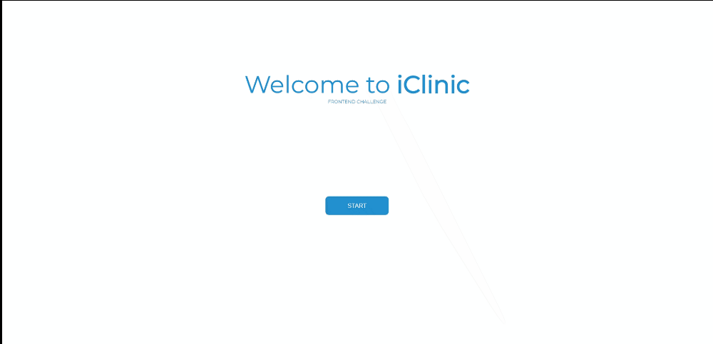

# iClinic Challenge

This challenge was proposed by [iClinic](https://github.com/iclinic/challenge-front).


### Screenshot




### Links

- Solution URL: [GitHub](https://github.com/bellrodrigs/iclinic-desafio)
- Live Site URL: [Netlify](https://choose-your-master.netlify.app)

### Run project locally
Step 1: Go to folder
```sh
$ cd iclinic-desafio
```

Step 2: Install the dependencies
```sh
$ yarn install
```
or
```sh
$ npm install
```

Step 3: Run the api
```sh
$ yarn start
```
or
```sh
$ npm start
```

If the default browser does not take you directly to the address the project is running on, go to [React on Localhost](http://localhost:3000)

### Built with

- Semantic HTML5 markup
- CSS custom properties
- Flexbox
- Mobile-first workflow
- [React](https://reactjs.org/) - JS library
- [Styled Components](https://styled-components.com/) - For styles
- [Axios](https://axios-http.com/docs/intro) - For manage states

